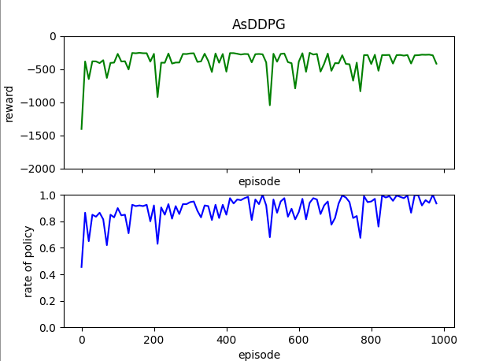
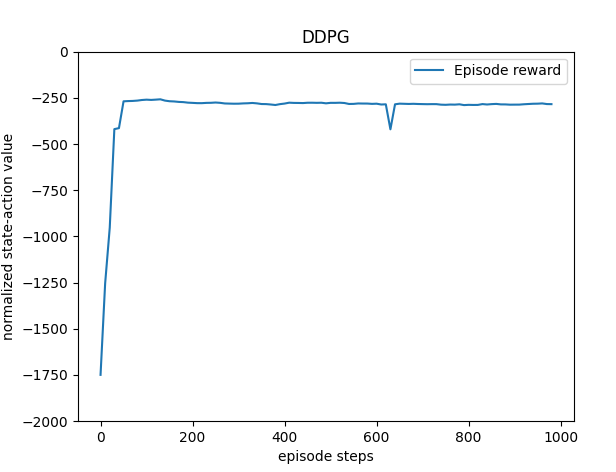

# Requirements
Conda visual env
Python 3.10.2
Tensorflow 2.14.0
tensorlayer 2.2.5

Besides, we need to replace file _/path/to/your/anaconda3/envs/tf_RLcode/lib/python3.10/site-packages/tensorlayer/files/utils.py_ 
with _tf_utils.py_ in the current directory. 

Then the weights of models can be saved successfully.


 # An unofficial implementation of [AsDDPG](https://ieeexplore.ieee.org/abstract/document/8461203)
This repository presents a comparative analysis between the AsDDPG method and the conventional DDPG network in the task of maintaining the pendulum in an upright position.

We employ the pre-trained DDPG model, denoted as **B**, located at ./model/Good_ddpg_xxx, as an external controller to expedite the convergence of our primary DDPG model denoted as **A**. The latter requires training with the assistance of another pre-trained DDPG model **B**.

 The result of AsDDPG for pendulum controlling:
<p align="center">
  
</p>

 The result of DDPG for pendulum controlling:
<p align="center">
  
</p>

Comparing these figures, we can see that in the AsDDPG file, __an external controller can indeed shorten the time of convergence__ to achieve the best total reward. However, in the limited 1000 episodes, both the policy network utilization rate curve and total reward curve show significant fluctuations. Additionally, through testing, we found that the performance (total reward collected in one episode) of the trained **A** model __falls short__ of **B**.

__That is:__
1. AsDDPG shorten the time of DDPG's convergence;
2. In the limited episodes, DDPG is not converged, and DDPG's performance is lower than external controller.


# Run
First, we train the DDPG as baseline, and take the trained model as **A**, train and test(after modify the /path/to/your/trained/model in fuction *load_ckpt*)
```
python DDPG_pendulum.py
python DDPG_pendulum.py --train_or_test 0
```

Then it's the turn of AsDDPG to get **B**, train and test(after modify the /path/to/your/trained/model in fuction *load_ckpt*)
```
python AsDDPG_pendulum.py
python AsDDPG_pendulum.py --train_or_test 0
```
